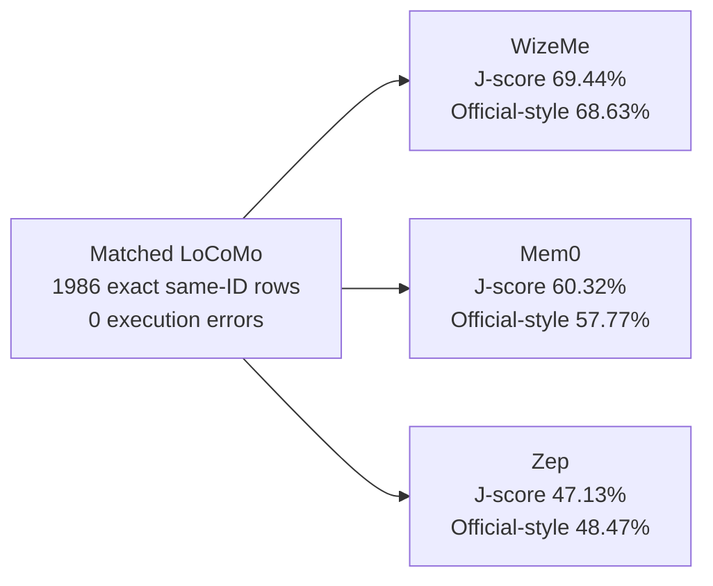

# WizeMe, Mem0, and Zep: Matched LoCoMo Reference

Scope: 1986 exact same-ID rows, zero errors, dataset SHA-256 `79fa87e90f04081343b8c8debecb80a9a6842b76a7aa537dc9fdf651ea698ff4`.

| System | J-score | Official-style mean | Answer p95 | Judge p95 | Comparable latency |
| --- | ---: | ---: | ---: | ---: | --- |
| WizeMe | 69.44% | 68.63% | 14027 ms | 8022 ms | N/A |
| Mem0 | 60.32% | 57.77% | 13430 ms | 8918 ms | N/A |
| Zep | 47.13% | 48.47% | 31804 ms | 6335 ms | N/A |

## Score Map

## Controlled Experiment

- Answer model: `deepseek/deepseek-v4-flash`
- Judge model: `x-ai/grok-4.5`
- Exact question IDs and categories: yes
- Context/retrieval mode: system under test
- Three-way latency comparison: N/A
- Three-way cost comparison: N/A

## Categories

| Category | Rows | WizeMe J | Mem0 J | Zep J | WizeMe official | Mem0 official | Zep official |
| --- | ---: | ---: | ---: | ---: | ---: | ---: | ---: |
| Multi-hop (1) | 282 | 46.45% | 40.78% | 31.21% | 56.04% | 54.31% | 42.95% |
| Temporal (2) | 321 | 72.9% | 67.91% | 23.68% | 69.63% | 57.82% | 34.93% |
| Open-domain (3) | 96 | 42.71% | 44.79% | 34.38% | 35.85% | 37.77% | 28.38% |
| Single-hop (4) | 841 | 72.77% | 56.36% | 55.05% | 71.12% | 52.36% | 52.99% |
| Adversarial (5) | 446 | 80.94% | 78.03% | 61.88% | 78.25% | 74.44% | 57.51% |

LoCoMo released-code category map: 1=multi-hop, 2=temporal, 3=open-domain, 4=single-hop, 5=adversarial. Public claims must not use paper-description ordering when labeling category IDs.

## Primary Intents

| Intent | Rows | WizeMe J | Mem0 J | Zep J |
| --- | ---: | ---: | ---: | ---: |
| fact | 881 | 68.22% | 59.14% | 50.28% |
| list | 197 | 66.5% | 58.38% | 49.75% |
| location | 134 | 67.91% | 59.7% | 50.75% |
| person | 94 | 79.79% | 59.57% | 59.57% |
| relation | 88 | 59.09% | 53.41% | 51.14% |
| temporal | 458 | 72.93% | 66.16% | 34.06% |
| visual | 134 | 70.9% | 56.72% | 52.24% |

## Paired Outcomes

- wizeme vs mem0: left-only 344, right-only 163, net 181, McNemar exact p=0
- wizeme vs zep: left-only 554, right-only 111, net 443, McNemar exact p=0
- zep vs mem0: left-only 222, right-only 484, net -262, McNemar exact p=0

## Boundary

Matched internal reference, not a universal leaderboard or SOTA claim. J-score and official-style mean are separate. Mem0 is Platform V3 and Zep is its approved Cloud V3 reference profile. Accuracy conditions are pinned; unmatched telemetry is not ranked.
